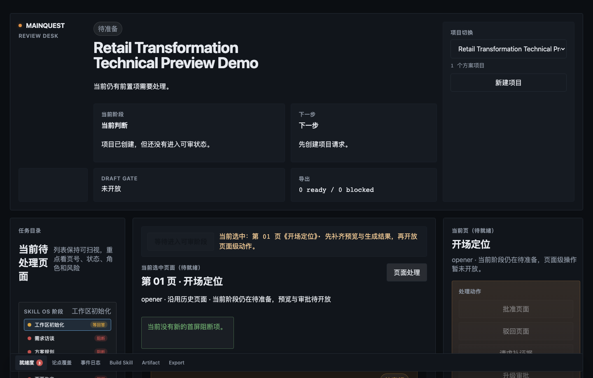

# Deck Master

Deck Master is a local-first Solution Deck Run OS. It turns a brief, source context, page plan, generation handoff, Review Desk decisions, build artifacts, and final readiness into one traceable workflow.

**Status:** v0.9.14-preview.4 / Technical Preview (agent-operable).
**License:** Apache-2.0.
**Support:** best-effort during preview.

Version mapping for this preview:

- GitHub release label: `v0.9.14-preview.4`
- Python package version: `0.9.14a4`
- Release notes: [v0.9.14-preview.4](docs/releases/v0.9.14-preview.4-release-notes.md)
- Release stage: Technical Preview / agent-operable
- Production readiness: not claimed

## Who It Is For

Deck Master is built for solution architects and proposal builders who need a repeatable way to decide which pages should be generated, which pages should be reused, and which pages are ready for review or delivery.

## SC-1.1: Built-in Native Deck Core

As of SC-1.1, the default build engine is the **built-in `deck_native`
compiler** (SVG subset -> native PPTX with real traces and readback) —
no external PPT Master install, binding or repository is required for
default production. Legacy `legacy-ppt-master` is an explicit
compatibility route only. Runs without an image-generation host tool
report `awaiting_agent_imagegen` honestly; the built-in kernel and the
default route are probed for real capability evidence, never from env
flags.

## The Full SC-1 Chain

Provide raw material + business goal + authorized host tools; Deck Master
carries the rest of the chain in one workflow — you do not write page drafts,
invoke external named skills, or know backend paths:

1. `start-conversation` ingests your raw material (full-text reading with
   coverage registration; PDF/DOCX/PPTX/images via host extraction tasks).
2. `build-brief` + research tasks: gaps are either filled from the material
   itself, turned into bounded research tasks (redaction-guarded), or surfaced
   as precise decisions — the material's tail constraints are never truncated
   away.
3. `autoplan` builds the solution model and narrative from the material, with
   candidate storylines and an explicit recommendation (or a truthful
   single-viable-path note).
4. The producer writes complete Page Packages (conclusion, business
   implication, evidence bindings) — production instructions never enter page
   text; pages without evidence or design basis stay draft.
5. Standard builds consume the approved Page Packages directly (PPT Master is
   the default, managed backend; high-density remains an opt-in profile).
6. Semantic review v2 (six dimensions) is a required production gate; a
   content change stales its binding; P0 findings cannot be overridden.
7. Export requires current final readiness + hash-bound delivery approval.
   Hidden notes/metadata in the client PPTX are scanned and block delivery.

Status and honest limits: see [Known Limitations](docs/known-limitations.md).
Engineering evidence: `docs/specs/sc1-solution-core-independence/implementation/`.

## Install

Use Python 3.12 by default for the Technical Preview. Deck Master preview
commands are tested on Python 3.11 and 3.12, but real PPT Library v2
integration requires Python 3.12+. Python 3.14 is not a supported test
environment because the PPTX dependency chain may not have compatible wheels
yet.

```bash
python3.12 -m venv .venv
. .venv/bin/activate
python -m pip install -e ".[dev]"
```

If local Python cannot bootstrap pip in a venv, use the equivalent uv path:

```bash
uv venv --python 3.12 .venv
uv pip install --python .venv/bin/python -e ".[dev]"
```

Source checkout commands use `python3 scripts/deck_master.py ...`. After the
editable install above, the equivalent installed command is `deck-master ...`.

## Run The Public Demo

```bash
bash scripts/demo.sh
python3 scripts/deck_master.py preview-gate --run-dir /tmp/deck-master-demo/oss-demo --expect-unconfigured-backend-ok
python3 scripts/preview/server.py /tmp/deck-master-demo/oss-demo
```

The demo uses fixture mode and synthetic retail transformation content. It is the default first-run path for v0.9.14-preview.4.

## Review Desk

Review Desk is the local browser interface for inspecting the generated page queue, checking page status, and approving work before export. M1 focuses on a public fixture demo and Review Desk preview. M2 will close the full production backend and release-candidate gates.



Review Desk write operations use a per-server local write token and same-origin guard. The server binds to `127.0.0.1` by default; non-loopback hosts require `--allow-remote-preview` and are only for trusted local-network demos. The write token is not a network authentication boundary because any browser that can load the page can read it.

For the full user path (install, demo, Review Desk, production configuration), see the [User Guide](docs/user-guide.md).

## Capability Boundaries

Current M1 guarantees:

1. Fixture demo from a public brief.
2. Review Desk preview for that demo.
3. Backend readiness transparency through `setup-status`, `suite-status`, and `backend status`.
4. `preview-gate` that works without a configured production backend.

Current M1 limits:

1. Production backend companions must be configured and verified before production commands can be treated as ready.
2. A missing `ppt-master` production backend must not be reported as `bound_verified`.
3. `ppt-deck-pro-max` is a Deck Master suite Skill for page production, not a separately bound production backend.
4. Browser smoke depends on local Playwright/browser availability.

See [Known Limitations](docs/known-limitations.md).

## Before Real Production Use

The preview demo is fixture-safe. Before using real customer material or
production deck assets, confirm these items explicitly:

1. Use Python 3.12 when integrating PPT Library v2.
2. Register and validate an active workspace; do not index Downloads, caches,
   raw customer folders, or private benchmark sources unless the user confirms
   that scope.
3. Confirm source authorization before indexing PPT files, screenshots,
   historical proposals, or customer context.
4. Check Agent and suite readiness:

```bash
python3 scripts/deck_master.py setup-status --include-suite --output json
python3 scripts/deck_master.py suite-status --target codex --output json
python3 scripts/deck_master.py agent-doctor --mode production --output json
```

5. Bind and verify a production PPT Master backend before treating build or
   export commands as delivery-ready:

```bash
python3 scripts/deck_master.py backend status
python3 scripts/deck_master.py backend bind ppt-master --repo <ppt-master-backend>
python3 scripts/deck_master.py backend verify ppt-master
```

If production readiness is blocked, keep the run in fixture/demo mode or stop
and repair the reported blocker.

## Core Commands

```bash
python3 scripts/deck_master.py --help
python3 scripts/deck_master.py setup-status --include-suite --output json
python3 scripts/deck_master.py suite-status --output json
python3 scripts/deck_master.py autoplan --brief-file examples/briefs/retail_digital_transformation.txt --industry retail --library-mode fixture --run-mode fixture --dev-allow-unsetup --runs-dir /tmp/deck-master-demo --run-id oss-demo
python3 scripts/deck_master.py preview-gate --run-dir /tmp/deck-master-demo/oss-demo --expect-unconfigured-backend-ok
```

After install, `deck-master --help` is equivalent to the source checkout help command.

## Release Gates

M1 uses `preview-gate` for v0.9.14-preview.4.
M2 uses `rc-gate` for formal release-candidate validation.

```bash
python3 scripts/deck_master.py rc-gate --output-dir /tmp/deck-master-rc --benchmark-dir benchmarks --skip-browser-smoke --force
```

## Project Docs

- [Quick Start](docs/quick-start.md)
- [Agent Entry](AGENTS.md)
- [Agent Task Index](docs/agent-task-index.md)
- [Known Limitations](docs/known-limitations.md)
- [PPT Library v2 Integration](docs/integration/ppt-library-v2.md)
- [PPT Master Integration](docs/integration/ppt-master.md)
- [Release Checklist](docs/releases/2026-07-06-release-checklist.md)
- [Contributing](CONTRIBUTING.md)
- [Security](SECURITY.md)
