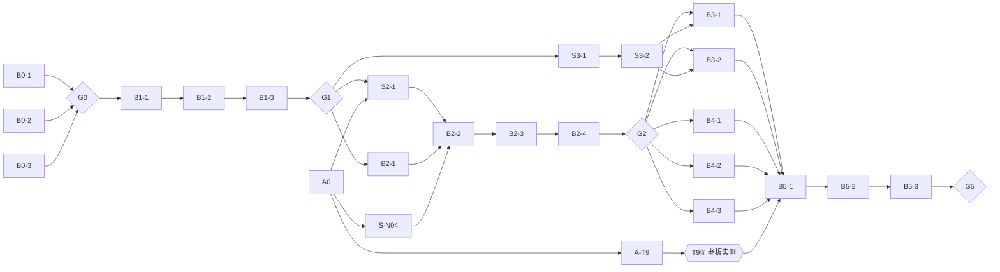

# B 路任务卡索引｜Deck Master Web UI 工作台重构

**版本：v1.0｜日期：2026-09-25｜分支：`codex/webui-rebuild`｜基线：`main@c93f5a2`**

本目录把 [04 执行单](../04-B路任务执行单.md) 的 P0–P5 拆成 **21 张可独立派发的任务卡**，另有 **3 张 A 路 / 核心卡**（A0、A-T9、S-N04，2026-09-26 补充）。执行单负责总览、缺口事实（G1–G6）和决策记录；任务卡是给执行 Agent 的操作输入。

## 角色

| 角色 | 负责方 | 职责 |
| --- | --- | --- |
| 执行者 | 其他 AI Agent（Codex / Kimi / OpenCode 等） | 领卡、实现、自测、回填交接 |
| 验收人 | Claude Code | 按卡中“验收方法”复现，给出 通过 / 退回 / 有条件通过 结论，写入卡末验收记录 |
| 决策人 | 老板 | G0 / G1 / G2 / G5 四个决策点签字；真实 Codex Desktop 往返配合 |

## 领卡规则

1. **一次领一张整卡**。先读本 README 的「通用规则」、卡内依赖和验收标准。依赖卡未验收通过，不得开工（卡内标注“可提前并行”的除外）。
2. **从最新 `origin/codex/webui-rebuild` 开分支** `codex/webui-<卡号小写>`（如 `codex/webui-b0-1`）；S 卡（共享接口）从 `origin/main` 开分支 `codex/shared-<卡号小写>`，PR 目标为 `main`。
3. 完成后：回填卡末「交接回填」→ 开 PR（B 卡目标 `codex/webui-rebuild`，S 卡目标 `main`）→ 通知验收人。**执行者不自行合并。**
4. 验收人退回时，在同一分支修复，不另开分支；卡的状态同步更新。

## 通用规则（所有卡适用）

- **测试环境**：本机 `python3` 是 3.14，超出 `requires-python >=3.11,<3.14` 且未装 pytest，**不能直接用**。每个工作目录先建一次环境：`uv venv -p 3.12 .venv && VIRTUAL_ENV=.venv uv pip install pip setuptools wheel build -e ".[dev]"`（`.venv` 已被 gitignore）；之后统一用 `.venv/bin/python -m pytest -q tests`。下文与各卡中的 `python3 -m pytest -q tests` 均指这条命令。基线：`codex/webui-rebuild@9d53f45` 为 437 passed。
- **测试基线**：开工前和提交前都跑上述测试命令。全绿才能提交；有已知失败必须在回填中写明并附输出。
- **共享文件**：`src/deck_master/view.py`、`web.py` 只能在 S 卡中修改，并先合入 `main`；B 卡在 rebase 后使用。B 卡**不得**修改 `service.py`/`tasks.py`/`editing.py`/`store.py` 的行为。
- **B 路自有范围**：`src/deck_master/resources/static/`、本目录文档、`tests/rebuild/` 下新增的 Web/浏览器测试。
- **真实数据**：所有界面状态来自真实 API。原型（B1-2）是唯一允许使用样本数据的卡，且每个样本必须带“样本”标记。
- **禁止**：修改 Builder / 制作链 / 审阅判定规则；客户原件、运行目录、密钥、调用私密记录进入仓库；为让测试通过而修改验收答案。
- **证据**：截图只使用测试夹具或 `examples/` 构造的项目，存到 `../assets/<卡号>/`；浏览器操作用 Playwright，截图文件名写明尺寸和场景。
- **不沿用旧记录**：T14 的关闭记录不能当作新 UI 的验收证据。
- **语言**：文档中文；代码、注释、标识符英文；界面文案中文，且不出现 hash、SVG 内部 ID、`awaiting_host` 等内部术语（诊断面板除外）。

## 全部任务卡

| 阶段 | 卡号 | 名称 | 类型 | 依赖 | 主要验收场景 | 状态 |
| --- | --- | --- | --- | --- | --- | --- |
| P0 | [B0-1](B0-1.md) | 旧 UI 浏览器基线复核 | 调研 | — | 全部（基线） | 有条件通过 |
| P0 | [B0-2](B0-2.md) | 宿主交接验证 | 调研+实测 | — | U04、U05 | 通过 |
| P0 | [B0-3](B0-3.md) | 接口映射与共享接口草案 | 调研 | — | 全部 | 有条件通过 |
| P0 | — | **G0 决策：交接主路径** | 决策 | B0-1/2/3 | — | 已决策（2026-09-26，见 04 §6） |
| P1 | [B1-1](B1-1.md) | 用户动作与状态表 | 设计 | G0 | U09–U11 | 已实现，待独立复核 |
| P1 | [B1-2](B1-2.md) | 可交互原型 | 设计 | B1-1 | U01–U08、U14 | 待领取 |
| P1 | [B1-3](B1-3.md) | 首版范围定稿（03 方案 v1.1） | 文档 | B1-2 | — | 待领取 |
| P1 | — | **G1 决策：首版范围** | 决策 | B1-3 | — | 待定 |
| P2 | [S2-1](S2-1.md) | 共享接口增量 I：修改往返 | 共享接口 | G1 | U03–U05 | 待领取 |
| P2 | [B2-1](B2-1.md) | 新工作台骨架与整稿概览 | 前端 | G1（可与 S2-1 并行） | U01、U02、U14 | 待领取 |
| P2 | [B2-2](B2-2.md) | 单页阅读、改字与框选意见 | 前端 | B2-1、S2-1 | U03、U04 | 待领取 |
| P2 | [B2-3](B2-3.md) | 等待、结果对比与再改 | 前端 | B2-2 | U04、U05 | 待领取 |
| P2 | [B2-4](B2-4.md) | 第一条真实往返验证 | 验证 | B2-3 | U04 | 待领取 |
| P2 | — | **G2 决策：第一条往返验收** | 决策 | B2-4 | — | 待定 |
| P3 | [S3-1](S3-1.md) | 整稿操作核心能力（A 路） | 核心 | G1（可提前） | U06、U07 | 待领取 |
| P3 | [S3-2](S3-2.md) | 共享接口增量 II：整稿与输入更新 | 共享接口 | S3-1 | U06–U08 | 待领取 |
| P3 | [B3-1](B3-1.md) | 整稿操作前端 | 前端 | G2、S3-2 | U06、U07 | 待领取 |
| P3 | [B3-2](B3-2.md) | 材料与目标更新前端 | 前端 | G2、S3-2 | U08 | 待领取 |
| P4 | [B4-1](B4-1.md) | 异常、冲突与重连 | 前端+测试 | G2 | U09–U11 | 待领取 |
| P4 | [B4-2](B4-2.md) | 历史比较与恢复 | 共享接口+前端 | G2 | U12 | 待领取 |
| P4 | [B4-3](B4-3.md) | 固定版本导出 | 共享接口+前端 | G2 | U13 | 待领取 |
| P5 | [B5-1](B5-1.md) | 打包、离线资源与 Skill 同版本 | 发布准备 | P3、P4 全部 | U15 | 待领取 |
| P5 | [B5-2](B5-2.md) | 正常安装下的真实使用验收 | 验证 | B5-1 | U01–U15 | 待领取 |
| P5 | [B5-3](B5-3.md) | 默认切换准备与旧界面退役方案 | 文档+候选 | B5-2 | — | 待领取 |
| P5 | — | **G5 决策：默认切换（需单独发布授权，对应 T25）** | 决策 | B5-3 | — | 待定 |

### A 路 / 核心卡（PR 目标 `main`）

| 卡号 | 名称 | 类型 | 依赖 | 覆盖 | 状态 |
| --- | --- | --- | --- | --- | --- |
| [A0](A0.md) | flow-quality T1–T8 交付与验收 | 交付+验收 | — | AC-01…AC-16 | PR #39 已实现（`fc6a949`），远端检查通过，待合入；未完成真实用户验收 |
| [A-T9](A-T9.md) | Codex Skill 注册、回滚、旧布局迁移（隔离 HOME） | 核心 | A0 | AC-18 | PR #39 已有实现及隔离验证；真实 HOME 迁移与 AC-17 后置 |
| [S-N04](S-N04.md) | 修改后产物被静默清空（首版必修） | 核心缺陷 | A0 | N04、R11、U03、U13 | 待领取 |
| — | **老板专属（后置）**：T9⑥ / AC-17 真实 Codex 会话、真实 `~/.codex/skills` 迁移、v0.9.15 发版 / tag / launchd | 决策+实测 | A-T9 | AC-17 | 后置，B5-1 之前 |

> PR #34（`codex/shared-skill-sync`）的内容已被 T7（`11d015e`）覆盖。A0 合入后建议关闭为 superseded，需要老板授权。
>
> A0 合入 `main` 后（含 T5 对 `view.py` / `static/` 的改动），`codex/webui-rebuild` 必须 rebase，之后 B 路 P2 卡才能开工。

## 依赖图

## 验收协议（验收人执行）

每张卡验收时，验收人至少做：

1. **范围核对**：`git diff origin/<目标分支>...HEAD --stat`，确认没有越出卡内「可改范围」，没有 console.log / debugger / TODO / 无关改动。
2. **测试复现**：在 PR 分支上亲自跑 `python3 -m pytest -q tests` 和卡内定向命令，不采信执行者贴出的结果。
3. **行为复现**：按卡内「验收方法」逐条实际操作（浏览器卡用 Playwright 在 1280×800 与 1440×900 下复现）。
4. **证据核对**：交接回填中的 SHA、截图、记录与实际一致；未验证项写明原因。
5. **结论**：在卡末「验收记录」写 通过 / 有条件通过（列条件与截止卡）/ 退回（列必须修复项），并更新本 README 状态列。

验收结论只有三种，不写“基本通过”。有条件通过的条件必须落到某张后续卡的验收标准里，否则视为退回。

## 卡片模板

每张卡统一包含：元信息 → 目标 → 背景与输入 → 可改范围 / 禁止 → 实施步骤 → 产出 → 验收标准 → 验收方法 → 交接回填 → 验收记录。
