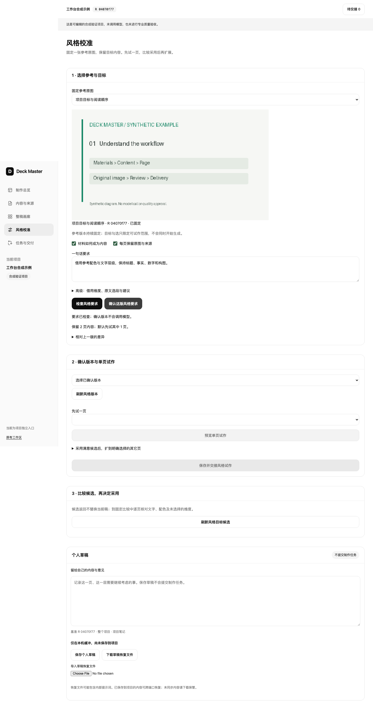
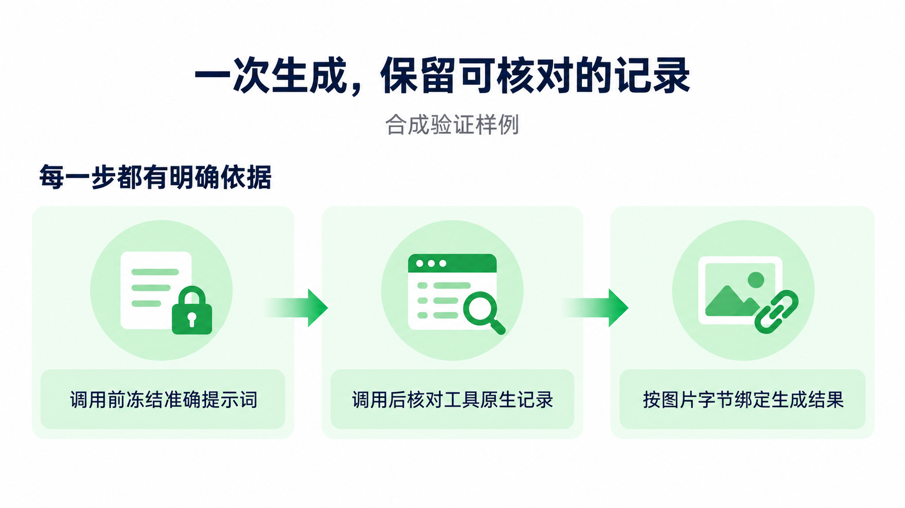
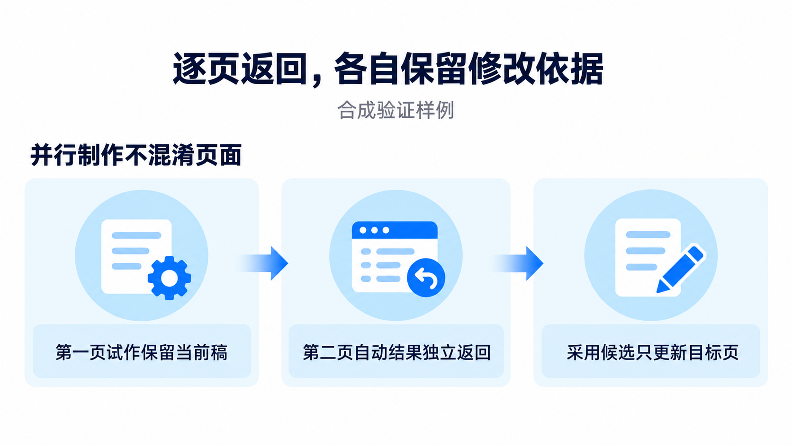
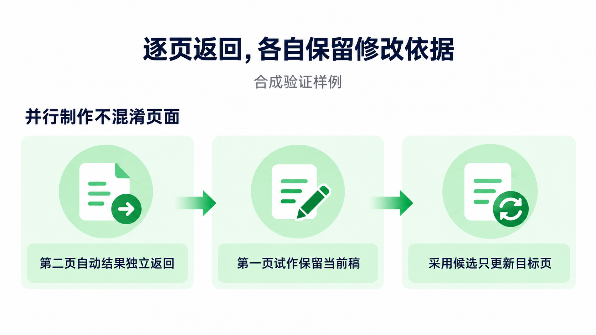
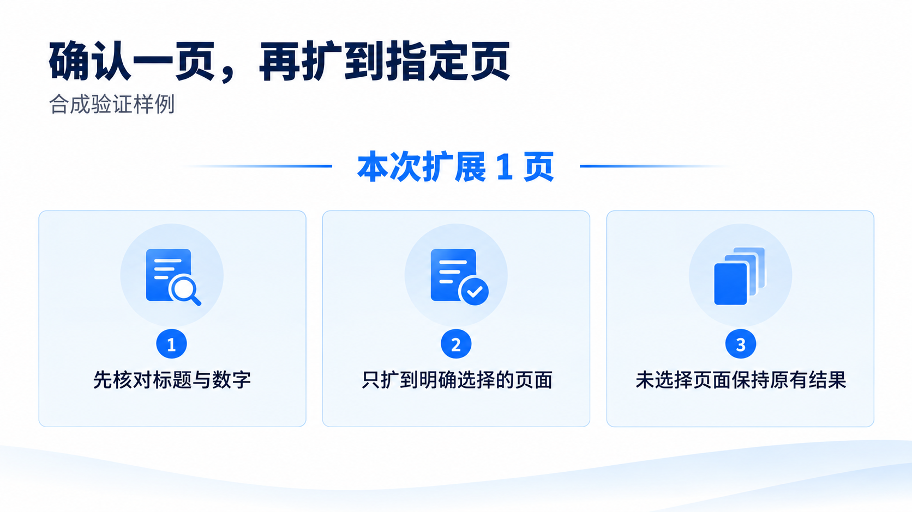
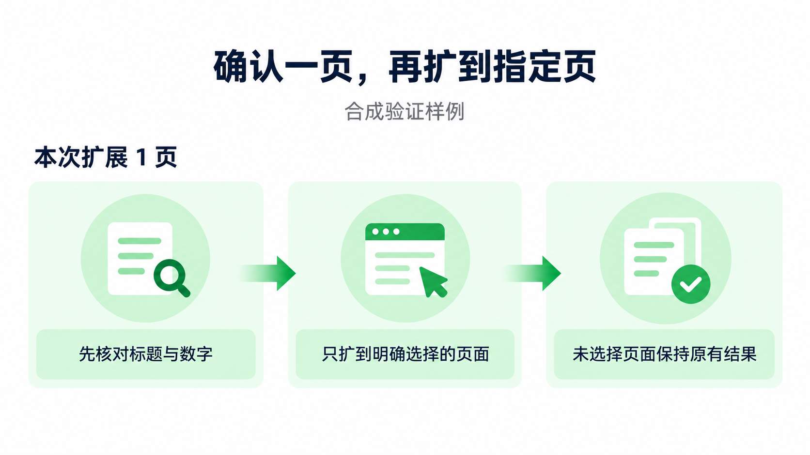

# W08 风格校准界面与真实效果记录

前置核心 [PR #58](https://github.com/MainQuestAI/Deck-Master/pull/58) 已合入 main `38d0b446592e8558b9126cfa85a484d2bddf557b`，之后才在 `codex/workbench-w08-ui` 接线。这个切片只改前端与验证/证据，不新增 schema、CLI、Host 或共享服务。实现提交 `fd05f563e692d49120e0fd3cefa4fc2e358e722f`，[前端 PR #59](https://github.com/MainQuestAI/Deck-Master/pull/59) 待 CI/合并。用户验收、实际 HOME 安装和发布未执行。

## 已实现的用户路径

从整稿选页或单页原图进入风格校准，参考页带固定版本和原图身份。简单路径只需选目标与写短要求；默认只借配色和文字层级。高级设置可单选构图等维度，阅读参考和目标原文、校验参考精确选段、保留未确认 Host 建议，并逐项处理极简/高密度冲突。历史实际提示词缺失时显示未知。

确认版本复用已有业务保存日志，确认本身不派发。先试一页，返回候选后跳到已有固定比较与采用界面；采用满意候选后再勾选剩余页并预览扩展调用上限。目标页变动时，计划逐页报告冲突；旧计划提交不新增任务或覆盖新内容，未变页可显式另建计划。配方、短要求、原文选段和试作范围保存在个人草稿，恢复不会自动派发。

回包丢失后保留原请求和 operation ID，重新打开后只核实该操作；后写草稿不替换原请求。使用已有图片池、导航与候选工作面，候选区只渲染最近 30 条目标页结果，其余可到任务页分页阅读。参考图不会跟随后台当前稿变化。

## 验证

- [主流程 14 项](w08/ui/checks.json)：简单路径、默认维度、确认无派发、单页试作、浏览器采用、明确扩展、修改范围使计划失效、高级版本、两种入口、1180 宽无横向溢出与浏览器无异常。
- [异常/恢复 9 项](w08/ui/edge-checks.json)：真实 API 校验原文选段、逐项冲突取舍、丢失确认回包并刷新后只核实一次、后写输入保留、并发内容变更拒绝旧计划、未变页另建计划、范围恢复。
- 既有 [W07 候选浏览器 15 项](w08/ui/w07-regression.json) 和 [W10 任务浏览器 13 项](w08/ui/w10-regression.json) 回归通过。
- [核心相关回归](w08/ui/pytest.txt)：62 passed；两份新示例 Ruff 通过。只验证相称范围，未重复此前 863 项全核心结果或 20 分钟压力结果。
- [隔离 wheel 核对](w08/ui/wheel-assets.json)：30 个 v2 文件与当前源码逐字节相同；没有安装进实际 HOME。

复现：`PYTHONDONTWRITEBYTECODE=1 PYTHONPATH=src python examples/workbench/w08_browser.py --out <new-dir>`，异常测试同理运行 `w08_browser_edges.py`。浏览器测试使用真实服务和明确标记的合成 Host 事件，实际模型调用为 0。它们不代替以下真实工具评价。

## 真实 Host 样本与结果

[原始文件与 SHA256 清单](w08/real-host/manifest.json)、[逐维度评价](w08/real-host/visual-review.json)、[本机 Vision OCR 记录](w08/real-host/ocr-results.json)。三页均为合成软件验证内容；图像来自真实原生 ImageGen，冻结请求与实际工具观察四次均 match，不代表客户内容或专业审图通过。

实际新增调用共 **4 次**：第三页蓝色基线 1 次、第二页通用配方试作 1 次、第二页诊断重试 1 次、第三页明确扩展 1 次。第一次试作初看时误以为“第一页”缺“页”；两张候选的 OCR 均读出完整文字，复核后撤销漏字判断。额外诊断调用归因于观察误判，不归因于已证实的模型漏字。采用的是第一张通用配方候选，第二张保留为未采用诊断记录。

| 维度 | 第一目标页试作并采用 | 第三页明确扩展 |
|---|---|---|
| 标题、事实、数字 | 结构化标题、分组标题和三条正文完整；文字顺序按结构化正文，原蓝色图有两条顺序交换 | 标题、三条正文及“本次扩展 1 页”保留 |
| 所选风格 | 蓝色改为绿色，浅绿卡片与主次文字层级清楚 | 绿色强调与浅绿卡片达到要求 |
| 未选维度 | 图标发生变化，不宣称像素级保留 | **不满意**：标题居中、分组标题左移、编号圆点消失、新增箭头、底部波纹消失 |
| 当前稿与采用 | 仅该目标原图替换，其 Page 保留，下游 SVG 失效；参考页与第三页完整条目不变 | 返回候选，**未采用**；参考页、第一张已采用页及第三页原图均不变 |

请求明确禁止借未选构图，但本轮只附参考页图，未把目标原图作为 edit target；因此文字约束没有保证目标构图保持。此处保留不满意结果，不用“提示词匹配”宣称视觉成功，也不扩大为跨样本改善率。

### 固定原图与候选

参考页：

| 第一目标原图 | 通用配方候选，已采用 |
|---|---|
|  |  |

| 第三页原图 | 扩展候选，未采用 |
|---|---|
|  |  |

界面与机制已完成上述工程验证，效果评价包含明确的不满意结论。W08 各 AC 不代签用户验收；后续 W09 仍按核心先 main、前端后接线推进。
