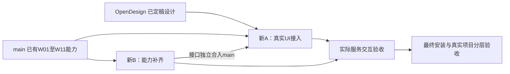

# Deck Master Web UI 新开发基线

2026-09-30 · 已收讫设计并完成本轮差距梳理、Spec与两线工作树准备；**尚未实施这些新增项**。

结论：既有W01–W11工程能力已经进入main。本轮应在现有运行核心上落实OpenDesign的新界面，并补“可行动待办、有效项目能力、正文/结构候选、候选决定、个人状态清理”等缺口；不重做12个旧包。

## 交付入口

| 内容 | 文件 |
|---|---|
| 用户已定稿设计：17文件完整接收 | [收讫目录](../../design/webui-opendesign-20260930/README.md)、[原型](../../design/webui-opendesign-20260930/index.html)、[设计体系](../../design/webui-opendesign-20260930/design-system.html)、[状态页](../../design/webui-opendesign-20260930/states.html) |
| 生产适配决定 | [DESIGN-ADAPTATION](DESIGN-ADAPTATION.md)、根[DESIGN](../../../DESIGN.md) |
| 当前功能核验/剩余范围 | [53项功能核对](GAP-MATRIX.md)、[动作清单](DESIGN-ACTIONS.md)、[核验证据](evidence/README.md) |
| 新A：UI实现 | [A Spec](A-UI-SPEC.md)、[接手入口](HANDOFF-A.md) |
| 新B：功能补齐 | [B Spec](B-CAPABILITIES-SPEC.md)、[接手入口](HANDOFF-B.md) |
| 逐包实施 | [15张卡 / 45条新AC](task-cards/README.md)、[两线接口](INTERFACES.md)、[执行顺序](EXECUTION.md) |
| 原12包延续 | [87旧AC接续](ACCEPTANCE-CARRYOVER.md)、[完整行为及证据JSON](acceptance-carryover.json) |
| 共同基线与清理 | [分支治理](BASELINE-GOVERNANCE.md) |

## 两条线

| 线 | 分支 | 工作树 | 首卡 |
|---|---|---|---|
| 新A：Web UI实现，8包 | `codex/webui-a-implementation` | `/Users/dingcheng/.codex/worktrees/webui-a/Deck-Master` | A01 设计基础+PR66有限修复评审 |
| 新B：功能补齐，7包 | `codex/webui-b-capabilities` | `/Users/dingcheng/.codex/worktrees/webui-b/Deck-Master` | B01 可行动读模型+schema修复 |

共同代码基础 `origin/main@66da345c84de48933a76de577114f08dcebf4f0e`；本次设计与Spec提交由本地tag `baseline/webui-v4-20260930` 固定。两条分支从同一tag开始，初始产品代码相同。

## 核验结论及建议

- 已复用：项目启动、全链路读模型、请求与实际调用证据、整稿阅读、结构化标注/批量事务、原图/SVG候选、风格recipe、内容/输入更新、任务恢复、固定版本与三用途导出。工程实现存在不等于最终验收通过。
- 本轮新增/修补：summary候选schema不一致；attention/prompt/下一动作缺项；旧项目动作可用性与服务能力混淆；正文、合并/拆分和材料影响缺“回传候选后再采用”；保留当前没有持久决定；原型reset必须限定个人状态。
- UI主体变化：最新浅色黑按钮规范、项目卡、明确待办的总览、完整制作矩阵、连续整稿、分层单页、渐进风格设置、任务/交付和六种异常状态。示例数据及模拟推进不进入生产。
- 验证债务：W08曾观察到未选构图漂移；W12安装摘要已追回，但其20分钟压力记录失败。还需正向跨页风格、30页真实项目、真实macOS目录对话框、最终候选安装/导出/回退和新UI浏览器证据。

本轮148项定向测试通过，5项临时项目探针通过其核验断言，其中3项确认缺口、1项确认已补能力、1项确认能力门禁差异。两处内容变更采用时机差距另由源码验证。没有重新进行全量905项测试、完整浏览器QA、真实Host生成或最终安装验收。

建议先做A01与B01；B02完成显式主流程入口后，A快速形成可运行总览/整稿阅读。B03必须先把“结果返回”和“用户采用”分开，A再接正文/结构/材料候选，不以按钮文案掩盖后台已改稿。详细依赖以执行表为准。
