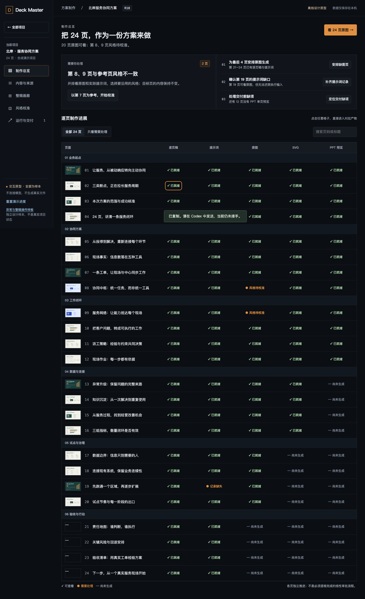

# Deck Master 生成工作台 v3

**把二三十页 PPT 当作一份连续制作的方案来工作：先看全稿，再从有问题的一页找到生成依据，在正确阶段修改，比较后采用。**

这套设计覆盖材料、内容整合、大纲、逐页稿、提示词、原图、SVG 与 PPT。它把原来分散在文件和会话里的过程连到同一页、同一版本上；审阅是其中一个动作。

[在 OpenDesign 看 24 页主原型](http://127.0.0.1:52366/api/projects/deck-master-generation-workbench-v3-20260926/raw/index.html) · [OpenDesign 状态样板](http://127.0.0.1:52366/api/projects/deck-master-generation-workbench-v3-20260926/raw/states.html) · [本地备用入口](http://127.0.0.1:8766/) · [按路径走查](WALKTHROUGH.md) · [完整方案](PLAN.md) · [12 个开发包](packages/README.md)

主原型使用 **24 页合成数据**；另有 6 个独立状态样板，演示正文、恢复和整稿调整，不连接模型或真实项目。若链接未打开，请按文末启动方式运行。正式功能尚未实施；原型能点通不代表生产链路已完成。

## 这是什么入口，什么时候打开

Web UI 是独立可打开的生成工作台，与 Codex / CLI 操作同一个项目。用户可以自己找回项目、看现状、保存要求；实际生成仍由 Host 执行。没有打开聊天窗口时也应能阅读，复制交接文本只表示复制成功。

| 打开时机 | 要解决的问题 | 主要动作 |
|---|---|---|
| 开始制作 | 材料要讲成什么，面向谁 | 新建项目、选入材料、说明目标，交接内容整理 |
| 大纲和逐页稿形成 | 论证是否完整，依据在哪里 | 看章节和来源，改内容或请求改写 |
| 第一批原图出现 | 二三十页能否连起来看，风格是否一致 | 看整稿联系表或连续阅读，定位异常页 |
| 某一页好、相邻页偏 | 什么值得沿用，哪些内容必须保留 | 选参考与目标、写一句要求、先试一页 |
| SVG / PPT 返回 | 哪个转换阶段出了问题 | 同页跨层比较，在准确阶段修复 |
| 中断后回来 | 谁在处理，轮到我做什么 | 看真实运行状态，继续交接、比较或恢复 |
| 需要交文件 | 哪一版可用，缺什么 | 固定版本，选择审阅、交付或工程用途 |

不用 Web UI，仍可通过 Codex / CLI 制作，核心仍记录过程和检查质量。使用 UI 的价值是整体观看、精确定位、跨页校准与可控试作；不会增加逐页审批的必经关卡。

## 工作流：从看到问题到改变结果

```text
材料 → 内容整合 / 大纲 → 逐页稿 → 冻结的生成请求 → 原图 → SVG → 整稿 PPT
                                      ↑            │
                               风格参考与调整      │
                                                   ↓
看全稿 → 选一页 → 查当次依据 → 选修改阶段 → 先试 → 交接 → 比较候选 → 采用
                                                               │
                                          只更新受影响的下游 ←──┘
```

图中的阶段可以并存：有些页已有原图，有些页只有正文，整稿 PPT 可能仍是旧版。界面分别显示“可看什么”“谁在执行”“是否采用”“需要你决定什么”，不能用一个“完成”替代这些事实。

三个关键设计判断：

- **实际提示词必须有来路。** 从图进入当次请求，区分预备文本、Host 申报和工具观察；历史未记录就显示未知，不能用最新稿件补造。
- **改风格先保留目标内容。** 第 7 页可作为第 8 页的视觉参考；标题、事实、数字仍属于第 8 页。默认只选参考、选目标、写一句要求，高级设置按需展开。
- **试作、采用与交付分开。** 试作提交和返回本身不替换当前采用；其他自动生产可继续，固定比较不会跟着漂移。采用才更新对应结果并传播影响，质量检查决定是否可交付。

## 五个工作面，各有明确的下一步

| 工作面 | 进入后看什么 | 可以做什么 |
|---|---|---|
| [制作总览](http://127.0.0.1:8766/#overview) | 项目背景、可看产物、需要人处理的事项、页 × 阶段矩阵 | 看整稿、定位缺项、回到待处理请求 |
| [内容与来源](http://127.0.0.1:8766/#content) | 大纲、逐页内容、材料关联和影响判断 | 调整内容与顺序、补材料、请求复杂改写 |
| [整稿画廊](http://127.0.0.1:8766/#gallery) | 同一产物层的全稿，缺项保持空位 | 连续阅读、筛页、进入单页、选择比较与风格参考 |
| [风格校准](http://127.0.0.1:8766/#style) | 固定参考页、目标内容、简明要求、候选比较 | 先试一页，采用后再应用到明确范围 |
| [运行与交付](http://127.0.0.1:8766/#runs) | 待交接、处理中、已返回与失败记录，指定版本文件 | 复制交接、核实状态、比较结果、恢复、导出 |

单页工作台贯穿五个区域：来源、逐页稿、提示词、原图、SVG、PPT 是同一页的不同视图。需要时展开依据和意见，避免始终塞满三个侧栏。上表为正式设计范围；当前原型覆盖情况见 [原型说明](prototype/README.md)。

**标注会提供。** 正式方案包括整稿、章节、页、产物意见，以及点、框选、文本范围等适用定位；保存意见和提交执行是两个动作。原型已演示整页意见、矩形框选、独立提示词草稿和交接。自由排版、任意形状编辑、外部 PPT 自动回写不在本期。

## UI 效果与阅读顺序

冷墨界面、琥珀铜动作色、实面细线与克制圆角延续既定风格。画面优先给稿件，导航和运行信息为制作服务。设计宽度为 1280 × 800、1440 × 900；字体离线打包与许可检查归正式安装验收，原型使用本机可用字体回退。



先按 [WALKTHROUGH](WALKTHROUGH.md) 走三条主路径，再走补充状态样板；无需从包含评审记录的长计划开始理解产品。主原型侧栏也有“异常与整稿操作样板”入口，两套样本存储隔离。

| 补充样板 | 可实际操作的设计路径 |
|---|---|
| [只有正文](http://127.0.0.1:8766/states.html#text) | 改标题 / 正文、保存样本版本、刷新、固定前后比较；不造缩略图 |
| [保存结果未知](http://127.0.0.1:8766/states.html#unknown) | 保留原请求和后写草稿；模拟核实，再决定重放或建立新草稿 |
| [内容冲突](http://127.0.0.1:8766/states.html#conflict) | 保留本机 / 服务端双方，复制并基于新版本建立独立草稿 |
| [批量部分返回](http://127.0.0.1:8766/states.html#batch) | 只采用已返回页、单独重试失败页；超时先核实、确认取消再交接 |
| [整稿调整](http://127.0.0.1:8766/states.html#structure) | 键盘重排、移除确认、合并 / 拆分请求、来源与采用影响 |
| [历史与恢复](http://127.0.0.1:8766/states.html#history) | 先查看、比较、确认，再形成新样本版本，保留调用 / 取消记录 |

状态样板的批量候选以明确标注的文字占位解释差异。它们可用于评审交互，不能证明服务端冲突恢复、真实 Host 调用、真实文件下载或生产持久化；任意页风格参考、点 / 文本标注仍未在原型中演示。

| 文档 | 回答的问题 |
|---|---|
| [PLAN](PLAN.md) | 为什么这样定义、对象怎样关联、完整范围与实施顺序 |
| [UI-SPEC](UI-SPEC.md) | 每个画面、主动作、状态、异常、响应式和键盘行为 |
| [DX-SPEC](DX-SPEC.md) | 当前如何运行原型，未来 CLI / HTTP / Host 怎样接入 |
| [ENGINEERING-SPEC](ENGINEERING-SPEC.md) | 事务、候选基准、草稿恢复、选区坐标、性能与安全怎样落地 |
| [CODE-BASELINE](CODE-BASELINE.md) | 当前代码已经有什么、需要新增什么 |
| [开发包索引](packages/README.md) | 每包边界、依赖、验收与回退 |
| [ACCEPTANCE](ACCEPTANCE.md) | 87 条行为验收的唯一归属与证据要求 |
| [LEGACY-COVERAGE](LEGACY-COVERAGE.md) | 旧 U01–U15 与 14 画面如何继承，哪些只是合成演示 |

## 分包交付

| 里程碑 | 开发包 | 用户得到的结果 |
|---|---|---|
| M1a：整稿可看 | [W01 链路读模型](packages/W01.md)、[W03 独立入口](packages/W03.md)、[W04 画廊与矩阵](packages/W04.md) | 先把已有二三十页放到一个可信的阅读工作面 |
| M1b：依据可查 | [W02 过程产物与请求](packages/W02.md)、[W05 单页链路](packages/W05.md) | 从图找到对应稿件与有证据支持的实际请求 |
| M2：修改可控 | [W06 标注与交接](packages/W06.md)、[W07 阶段重跑与候选](packages/W07.md)、[W08 跨页风格](packages/W08.md)、[W10 运行与恢复](packages/W10.md) | 真实试作、比较采用、跨页校准、中断恢复 |
| M3：完整制作与交付 | [W09 内容与来源调整](packages/W09.md)、[W11 版本与文件](packages/W11.md)、[W12 集成与安装](packages/W12.md) | 内容调整、固定版本文件、正常安装下全流程与回退 |

共 **12 个开发包、87 条唯一行为验收**。每次执行一张卡，共享核心与接口先进入主线，再接前端；读模型完成不能替代真实修改往返。详细依赖和建议顺序以开发包索引为准。

## 当前交付状态

<!-- delivery-review-status:start -->
GStack AutoPlan 及追加四轮 Review 已完成。R1 修复 6 项、R2 修复 9 组、R3 修订 5 项规格；R4 独立回归未发现新增实质缺陷，在两种桌面尺寸各通过 40 项检查。另有状态样板每视口 47 项检查。问题、修订与证据见[评审索引](reviews/README.md)；这些结果均不关闭生产 AC。AutoPlan 的 CEO 外部结果因缺少规定结束标记记为 unavailable，其他外部评审按实际记录；本轮没有运行自动视觉规则 detector。
<!-- delivery-review-status:end -->

正式工作台、真实请求绑定、两轮 Host 修改、正常安装与发布切换均未因本次设计交付而完成。安装候选验证与实际发布分开：正式默认切换仍按既有授权执行。

<!-- delivery-opendesign-status:start -->
已通过 OpenDesign MCP 导入 6 个原型文件，逐文件回读与本地内容一致；独立浏览器在两种尺寸各通过 21 项检查，6 个 HTTP 资源哈希一致，页面错误、外部请求和资源加载失败为 0。[OpenDesign 预览](http://127.0.0.1:52366/api/projects/deck-master-generation-workbench-v3-20260926/raw/index.html) / [项目源文件](http://127.0.0.1:52371/projects/deck-master-generation-workbench-v3-20260926/conversations/b29f2884-f0b0-4aa0-8fb7-e075c21f1023/files/index.html) / [核验记录](reviews/09-opendesign-sync.json)。这是经 MCP 导入并验证的设计原型，未委托生成 run。服务链接仅在当前本机 daemon 会话有效；离线源文件和下方启动方式持续保留。
<!-- delivery-opendesign-status:end -->

从仓库根目录启动原型：

```bash
python3 -m http.server 8766 --bind 127.0.0.1 --directory docs/specs/deck-master-workbench-v3/prototype
```

浏览器打开 [本地原型](http://127.0.0.1:8766/)，停止服务用 Ctrl+C。端口占用时可改成 8767，并同步修改浏览器地址；此页的 8766 链接需随之替换。
